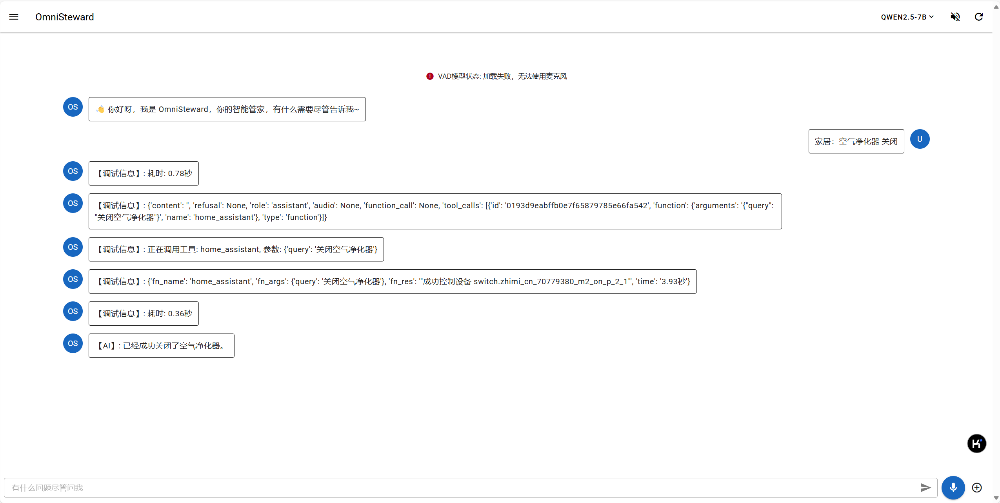

# Omni-HA

这是[全能管家(Omni-Steward)](https://github.com/OmniSteward/OmniSteward)的Home Assistant工具，通过自然语言控制Home Assistant中的智能家居设备，这是一个子Agent形式的工具。

注：由于现在米家官方支持Home Assistant，因此本工具也可通过HA来控制米家设备，参见 [XiaoMi/ha_xiaomi_home](https://github.com/XiaoMi/ha_xiaomi_home/tree/main)。



## 工具概览

- 工具描述: 允许Omni-Steward通过自然语言与Home Assistant进行交互，控制智能家居设备
- 工具ID: `omni_ha.HomeAssistant`
- 工具名: `home_assistant`
- 工具参数: （在Omni-Steward Config中配置）
    - `openai_api_key`: OpenAI API密钥
    - `openai_api_base`: OpenAI API基础URL
    - `model`: 要使用的模型名称，因为这是一个子Agent，所以也需要使用LLM来处理用户的自然语言描述
    - `ha_url`: Home Assistant的URL, 如 `http://192.168.1.107:8123`
    - `ha_token`: Home Assistant的API令牌，如何获取详见[附录](#如何获取HomeAssistant的API令牌)
    - `ha_available_only`: True 可选，是否只显示可用设备, 默认只显示可用设备

## 安装
前置条件：
- 安装[steward-utils](https://github.com/OmniSteward/steward-utils)

随后执行：
```bash
pip install git+https://github.com/OmniSteward/omni-ha.git
```

## 使用

OmniToolID: `omni_ha.HomeAssistant`

### 1. 在Omni-Steward中注册使用工具
然后我们可以在Omni-Steward `Config` 中添加该工具，可以使用全路径，也可以使用name

1. 无需导入，直接使用工具ID进行注册
```python
# 使用全路径
tool_names.append('omni_ha.HomeAssistant')
```
2. 导入后使用工具名进行注册
```python
from omni_ha import HomeAssistant # 导入工具
tool_names.append('home_assistant') # 添加到工具列表
```

## 附录

### 如何获取HomeAssistant的API令牌

1. 在Home Assistant中，通过浏览器访问 http://IP_ADDRESS:8123/profile 进入个人资料页面
2. 在页面底部的"长期访问令牌"部分，点击"创建令牌"按钮
3. 输入令牌名称，点击"确定"按钮
4. 复制生成的令牌（请确保完整复制整个令牌），粘贴到Omni-Steward的配置文件中
更多参见[Home Assistant API令牌](https://www.home-assistant.io/docs/authentication/#your-account-profile)